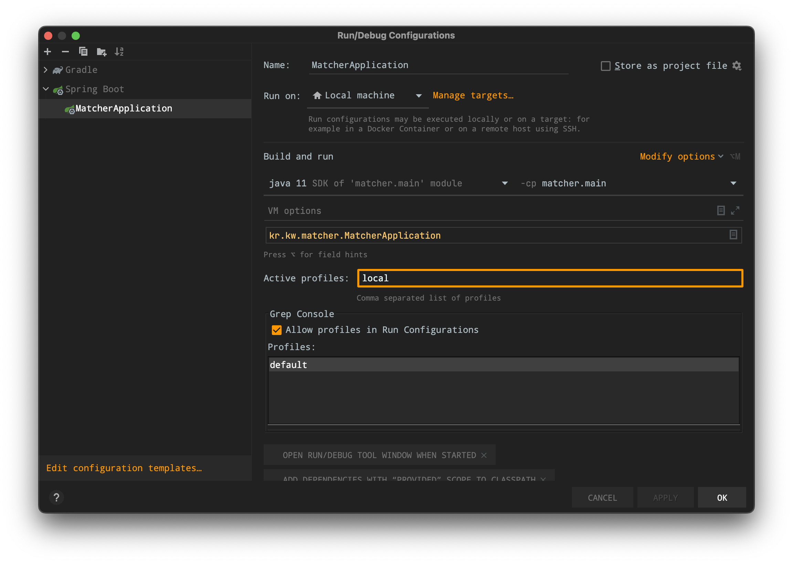
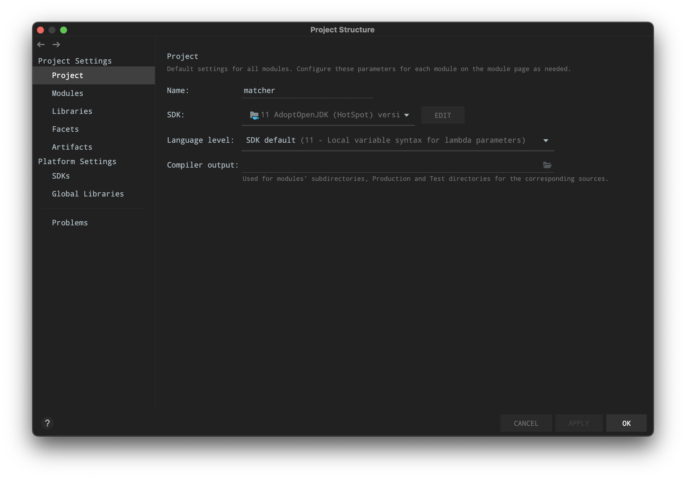

# How To Run
First, you have to target profile `local`. If you are using IntelliJ, set profile to `local` like below:

 Press `⌃ ⌥ R` on Mac to open `Run/Debug Configurations`.

### Check JDK version
Next, Check your JDK version. This project is using JDK 11.

Press `⌘ ;` on Mac to open `Project Structure`.